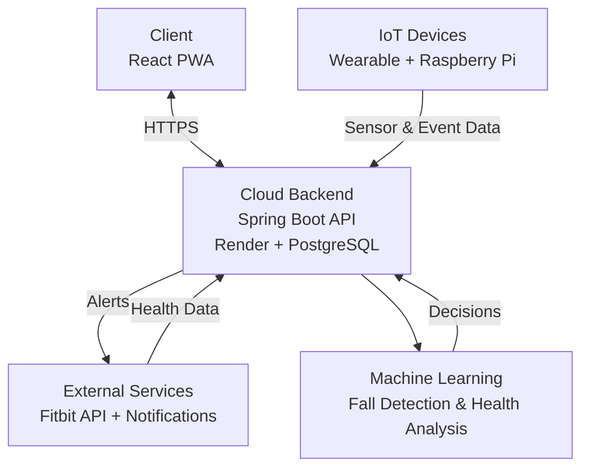

# SmartGuardian

## Overview
SmartGuardian is a secure AI-Integrated digital health application designed to support vulnerable users through real-time fall detection, long-term health analysis, and rapid emergency alerting.

---

## Project Objectives

- Detect fall events using motion sensing and machine learning.
- Analyse long-term health trends using wearable health data.
- Provide timely emergency alerts with GPS information.
- Ensure secure handling of sensitive health data in line with GDPR principles.

---

## Technology Stack

- **Frontend:** React (Progressive Web App)
- **Backend:** Spring Boot (Java)
- **Security:** Spring Security, JWT authentication
- **Database:** PostgreSQL
- **Cloud Hosting:** Render (PaaS)
- **IoT Devices:** Raspberry Pi 5, M5StickC PLUS2, IMU, GPS, Sense HAT
- **Machine Learning:** Python-based models
- **External APIs:** Fitbit Web API

---

## System Architecture

---

## Author
Developed by Louise Deeth
