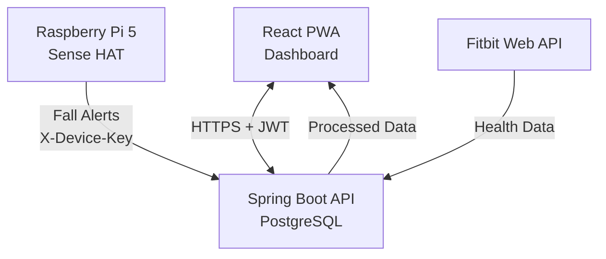
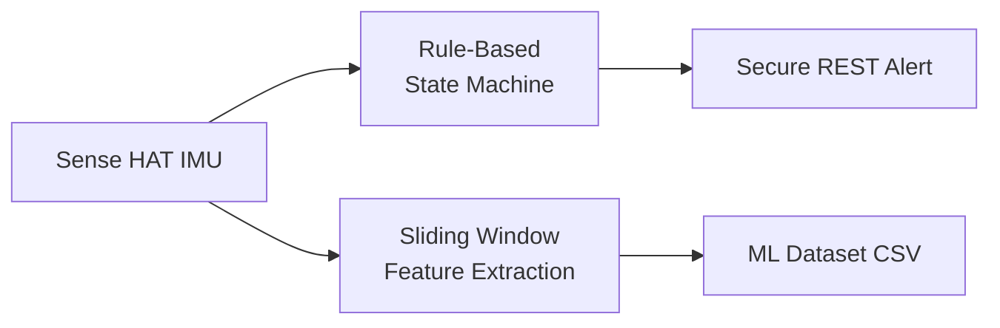

# SmartGuardian

SmartGuardian is a secure AI-integrated digital health application designed to support vulnerable users through real-time fall detection, long-term health analysis, and emergency alerting.

Developed by Louise Deeth as a final year B.Sc. (Hons) Software Development project at Atlantic Technological University.

## Repositories

| Repository | Description |
|---|---|
| [health-app-backend](https://github.com/secure-health-app/health-app-backend) | Spring Boot REST API, JWT authentication, PostgreSQL |
| [health-app-frontend](https://github.com/secure-health-app/health-app-frontend) | React PWA dashboard |
| [pi-fall-detector](https://github.com/secure-health-app/pi-fall-detector) | Raspberry Pi fall detection and ML dataset generation |

## Project Objectives

- Detect fall events using motion sensing and machine learning
- Analyse long-term health trends using Fitbit wearable data
- Provide timely emergency alerts when a fall is detected
- Ensure secure handling of sensitive health data in line with GDPR principles

## Technology Stack

- **Frontend:** React (Progressive Web App)
- **Backend:** Spring Boot (Java)
- **Security:** Spring Security, JWT authentication
- **Database:** PostgreSQL
- **IoT:** Raspberry Pi 5, Sense HAT V2 (accelerometer + gyroscope)
- **Machine Learning:** Python (scikit-learn)
- **External APIs:** Fitbit Web API

## System Architecture

## Detection Architecture (Edge Device)

